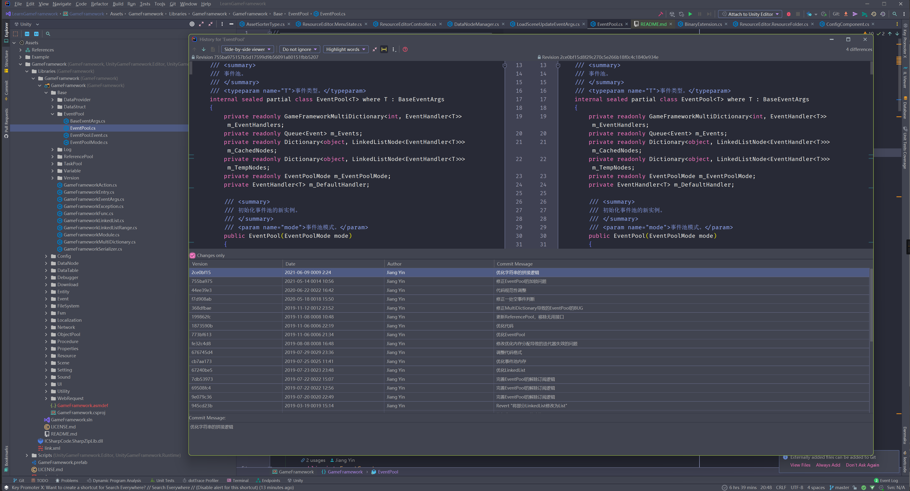

# LearnGameFramework

Unity 2021.2.6f1

这个仓库是为了方便学习 [EllanJiang/GameFramework](https://github.com/EllanJiang/GameFramework) 和 [EllanJiang/UnityGameFramework](https://github.com/EllanJiang/UnityGameFramework) 模板工程。
工程中添加了对应仓库的 fork 作为 submodule ，并处理好依赖，这样方便通过看 Git log 学习框架。 

感谢 [EllanJiang](https://github.com/EllanJiang) 带来这么好的框架。

## 下载

```shell
git clone --recursive -j8 https://github.com/Latias94/LearnGameFramework.git
```

## Git log

